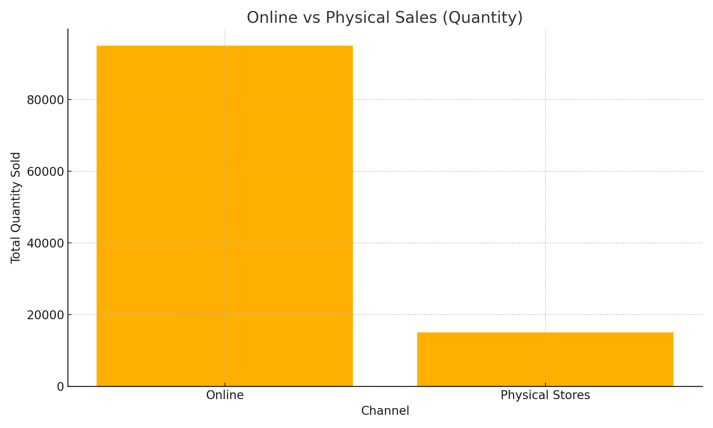
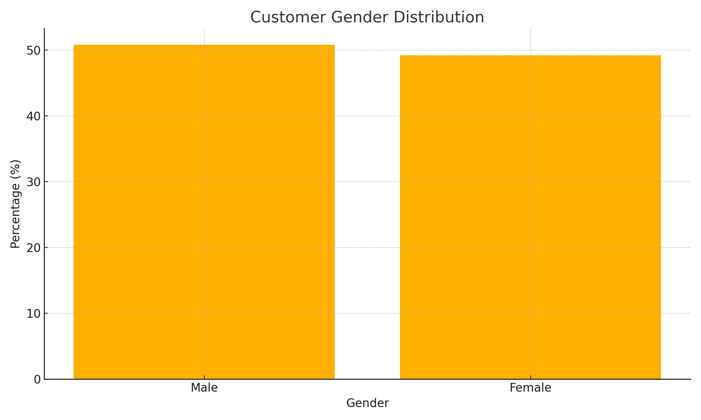
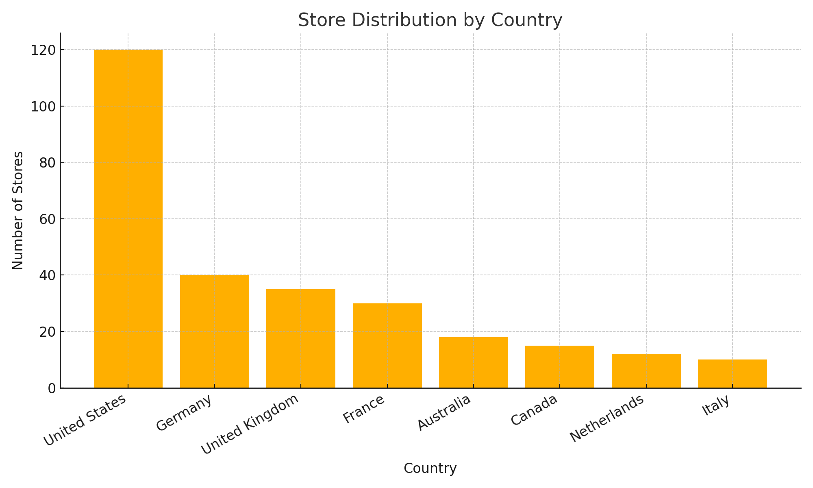
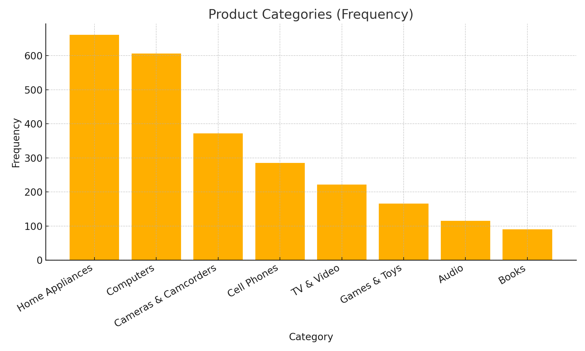

# Final Project - MIS 301  
**Global Retail Company Analysis**  

[📄 View Full Report (PDF)](Final_project_MIS_301.pdf)

---

## 📌 Introduction
This project analyzes global retail sales data from multiple datasets, including Stores, Sales, Products, Exchange Rates, Data Dictionary, and Customers.  
The goal is to clean, aggregate, and visualize the data to provide actionable insights for business decision-making.

---

## 🛠 Technologies Used
- **Python**: Data processing and analysis
- **Pandas**: Data cleaning and manipulation
- **Matplotlib / Seaborn**: Data visualization
- **Google Colab**: Development and execution environment

---

## 📊 Workflow

### 1. Data Cleaning
- **Customers**: Filled missing `State Code` values using the `State` column.
- **Sales**: Removed the `Delivery Date` column as instructed.
- **Stores**: Deleted rows missing `Square Meters` values.

### 2. Data Analysis
#### Online vs. Physical Sales
  
Online sales significantly outperform physical stores.

#### Customer Gender Distribution
  
Male: **50.8%**, Female: **49.2%** — balanced distribution.

#### Store Distribution by Country
  
The US has the highest store count, followed by Germany and the UK.

#### Product Categories
  
Top categories include **Home Appliances** and **Computers**.

---

## 📈 Key Insights
- **Online sales** are the largest revenue driver.
- **Gender balance** suggests marketing appeals to all demographics.
- **The US is the primary market**, with opportunities for expansion elsewhere.

